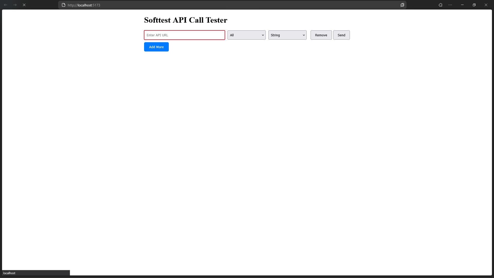
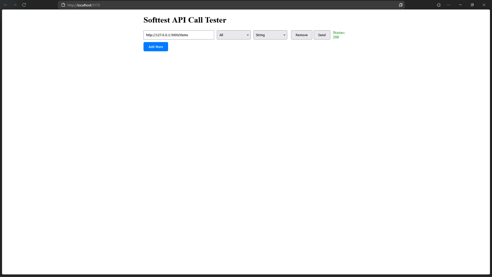

# Softtest

## Requirements

- Nodejs and vite latest version
- run `pip install -r requirements.txt` in home directory

## Run the web page 
Go to `softtest` directory and run

```bash
npm run dev
```

## Run sample backend
Go to  `sample backend` directory and run

```bash
python app.py
```

## Run softtest
Go to  `ml_softtest` directory and run

```bash
python app.py
```

## Sample program

Program overview


Here the default sample backend API is `http://127.0.0.1:5000/items` which takes a string object as the parameter, in the program
users can select what type of vulnerabilites to detect with softtest, currently soffttest provides XSS, sql injection and command injection. Users can also select what kind of parameter the API accepts.

Softtest answer



